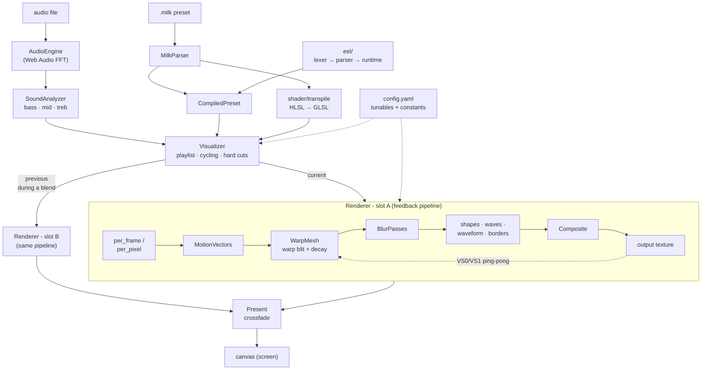

# Milkslop

A standalone WebGL2 port of the **MilkDrop 2** music visualizer, written from scratch in TypeScript.

> ⚠️ **Photosensitivity warning:** Milkslop generates rapidly flashing, strobing, and high-contrast visuals that react to audio, especially on beats and hard cuts. These may trigger seizures in people with photosensitive epilepsy. If you have a history of seizures or are sensitive to flashing lights, use caution - or avoid use altogether.

## Running

```bash
npm install
npm run dev
npm test
npm run build
npm run lint
npm run smoke
```

## Usage

The page renders the bundled default preset immediately; drag in (or pick) audio and the visuals react to it. The bundled playlist cycles through four presets - the no-shader `default`, the shader-driven `flow`, `froth` (a texture-based preset that warps a bundled foam image), and `rose` (a shaderless dot figure computed entirely in EEL via `loop()` and `gmegabuf`) - crossfading between them.

- **Drag in** (one or many) `.milk` preset files to add them to the playlist, audio files to queue & visualize, or image files to bind as preset textures (a shader's `sampler_<name>` resolves to the image dropped as `<name>.<ext>`).
- **Toolbar**: prev/next, preset list (☰), music queue (♫), freeze (⏸), hard cuts (⚡), fullscreen (⛶), help (?). A **sens** slider scales audio reactivity, an **fps** slider caps the frame rate (0–120 Hz, default 60, `0` = off), and a **blur** slider softens the output (0–40 px, `0` = off).
- **Preset list** (☰) and **music queue** (♫) open panels to search/jump presets and add/play/remove tracks; queued tracks auto-advance and the queue loops.
- **Load from URL**: the preset panel has a URL field (next to the file picker) that fetches `.milk` presets over the web - paste a direct/raw `.milk` link, a GitHub single-file link, or a GitHub folder URL (e.g. `https://github.com/projectM-visualizer/presets-milkdrop-original/tree/master/Milkdrop-Original`), which is listed and bulk-loaded. Presets only; textures they reference must still be supplied locally (drag them in).
- **Keys**: `N`/`→` next preset · `←` previous · `Space` freeze · `F` fullscreen · `H` toggle hard cuts · `?` help.
- **Query params**: `?fast` (cycle every 4 s), `?hardcuts` (start with hard cuts on).

## Presets

Milkslop reads standard MilkDrop `.milk` preset files - drag them onto the page to add them to the playlist. Thousands are freely available; some popular collections:

- [**Cream of the Crop**](https://github.com/projectM-visualizer/presets-cream-of-the-crop) - Jason Fletcher's (ISOSCELES) curated pack of the best released MilkDrop presets, hand-picked from tens of thousands. The default preset pack in most recent projectM releases, and the recommended starting point.
- [**MilkDrop original**](https://github.com/projectM-visualizer/presets-milkdrop-original) - the preset pack shipped with the last official MilkDrop release (textures excluded).
- [**projectM classic**](https://github.com/projectM-visualizer/presets-projectm-classic) - the classic projectM collection (~4,200 presets) published through version 3.1.12.
- [**MilkDrop texture pack**](https://github.com/projectM-visualizer/presets-milkdrop-texture-pack) - base textures many presets reference; drop the images in alongside `.milk` files (see the image-binding note under [Usage](#usage)).

> Presets that depend on textures need those image files bound too - drop them in as `sampler_<name>` → `<name>.<ext>` (see [Usage](#usage)).

You can also **generate** presets: [MilkDropLM](https://huggingface.co/InferenceIllusionist/MilkDropLM-7b-v0.3) is a fine-tuned language model that writes `.milk` presets from a text prompt.

### Testing sample set

A small, feature-diverse set of 13 presets useful for smoke-testing the renderer - greedily selected to cover the widest spread of preset features (custom shapes/waves, every wave mode, echo orientations, PS2/PS3 shaders, motion vectors, EEL edge cases, etc.) in as few presets as possible. Copy any of these raw links into the preset panel's URL field:

- [Phat+fiShbRaiN+Eo.S - Mandala Chasers remix](https://raw.githubusercontent.com/projectM-visualizer/presets-milkdrop-original/master/Milkdrop-Original/Phat%2BfiShbRaiN%2BEo.S_Mandala_Chasers_remix.milk)
- [Flexi - Milkcore [Martin's ripple on water insertion]](https://raw.githubusercontent.com/projectM-visualizer/presets-milkdrop-original/master/Milkdrop-Original/Flexi%20-%20Milkcore%20%5BMartin%27s%20ripple%20on%20water%20insertion%5D.milk)
- [martin - fruit machine](https://raw.githubusercontent.com/projectM-visualizer/presets-milkdrop-original/master/Milkdrop-Original/martin%20-%20fruit%20machine.milk)
- [ORB - Fireworks Sparkle](https://raw.githubusercontent.com/projectM-visualizer/presets-milkdrop-original/master/Milkdrop-Original/ORB%20-%20Fireworks%20Sparkle.milk)
- [Eo.S. + Geiss - glowsticks v2 03 music shifter edit b (water mix)](https://raw.githubusercontent.com/projectM-visualizer/presets-milkdrop-original/master/Milkdrop-Original/Eo.S.%20%2B%20Geiss%20-%20glowsticks%20v2%2003%20music%20shifter%20edit%20b%20%28water%20mix%29.milk)
- [phat + Eo.S. - PeopleWhoEatAcid phatColoursV2](https://raw.githubusercontent.com/projectM-visualizer/presets-milkdrop-original/master/Milkdrop-Original/phat%20%2B%20Eo.S.%20-%20PeopleWhoEatAcid_phatColoursV2.milk)
- [3dRaGoNs & Unchained - Dragon Science](https://raw.githubusercontent.com/projectM-visualizer/presets-milkdrop-original/master/Milkdrop-Original/3dRaGoNs%20%26%20Unchained%20-%20Dragon%20Science.milk)
- [Flexi - smashing fractals [acid etching mix]](https://raw.githubusercontent.com/projectM-visualizer/presets-milkdrop-original/master/Milkdrop-Original/Flexi%20-%20smashing%20fractals%20%5Bacid%20etching%20mix%5D.milk)
- [EMPR - Random - They're so cute, Dad can I keep one!](https://raw.githubusercontent.com/projectM-visualizer/presets-milkdrop-original/master/Milkdrop-Original/EMPR%20-%20Random%20-%20They%27re%20so%20cute%2C%20Dad%20can%20I%20keep%20one%21.milk)
- [Eo.S. + Phat - chasers 19 Portal](https://raw.githubusercontent.com/projectM-visualizer/presets-milkdrop-original/master/Milkdrop-Original/Eo.S.%20%2B%20Phat%20-%20chasers%2019%20Portal.milk)
- [Phat_Zylot_Eo.S. work with lines](https://raw.githubusercontent.com/projectM-visualizer/presets-milkdrop-original/master/Milkdrop-Original/Phat_Zylot_Eo.S.%20work%20with%20lines.milk)
- [Rovastar - Torrid Tales](https://raw.githubusercontent.com/projectM-visualizer/presets-milkdrop-original/master/Milkdrop-Original/Rovastar%20-%20Torrid%20Tales.milk)
- [Idiot - 9-7-02 (Remix 2)](https://raw.githubusercontent.com/projectM-visualizer/presets-cream-of-the-crop/master/Fractal/Nested%20Pyramid/Idiot%20-%209-7-02%20%28Remix%202%29.milk)

The first 12 are from [MilkDrop original](https://github.com/projectM-visualizer/presets-milkdrop-original), the last from [Cream of the Crop](https://github.com/projectM-visualizer/presets-cream-of-the-crop).

## Configuration

All global values live in [`config.yaml`](config.yaml), loaded at build time (via a small Vite YAML plugin) and exposed through `src/config.ts`. It has two sections:

- **`tunables`** - values safe to change: preset cycle/blend timing, hard-cut thresholds, warp mesh density, shuffle.
- **`constants`** - faithful 1:1 transcriptions of MilkDrop internals plus a few structural invariants, each annotated with its source provenance. These match the original C++ and are not tuning knobs.

Edit `config.yaml` and rebuild (the dev server hot-reloads); the named constants exported across `src/` all read from it.

## Architecture

milkslop turns live audio and a `.milk` preset into frames. Two input paths feed
a central **Visualizer**, which drives one or two **Renderer** instances and
crossfades their output to the screen:

- **Audio** is captured by `AudioEngine` (a Web Audio FFT) and reduced to
  normalized bass/mid/treb bands by `SoundAnalyzer`.
- A **preset** is parsed (`MilkParser`) and compiled (`CompiledPreset`): its
  equation blocks become EEL closures (`eel/`) and its HLSL warp/composite
  shaders are transpiled to GLSL (`shader/`).

The **Visualizer** owns the playlist, timed cycling, and beat-driven hard cuts,
and keeps **two `Renderer` slots** so a preset transition can run both presets
at once and crossfade them with `Present`. Each `Renderer` runs MilkDrop's
feedback pipeline into a ping-pong pair of textures (`FrameBuffers` VS0/VS1):
per-frame/per-pixel equations → motion vectors → warp blit with decay → blur →
shapes/waves/waveform/borders → composite. `config.yaml` supplies tunables and
engine constants throughout.



## Project structure

```
src/
  eel/        Expression engine: lexer → parser → closure compiler.
              Faithful ns-eel2 semantics (integer %, 64-bit & |, closefact
              comparisons, megabuf/gmegabuf, q/reg vars, if/loop/while).
  preset/     MilkParser (.milk INI → PresetState) + CompiledPreset (compiles
              per_frame_init/per_frame/per_pixel + custom waves/shapes).
  audio/      AudioEngine (Web Audio capture) + SoundAnalyzer (bass/mid/treb).
  shader/     HLSL→GLSL transpiler (transpile.ts), the MilkDrop shader
              environment/prologue (environment.ts), shared uniform binding
              (bindUniforms.ts), and the composite ShaderPass.
  render/     warp.ts (pure warp-mesh maths, unit-tested), FrameBuffers
              (VS0/VS1 ping-pong feedback), WarpMesh (with optional warp
              shader), MotionVectors (reverse-propagated mv_* line grid),
              BlurPasses, Waveform, Borders (ob_*/ib_* into the feedback),
              Composite, CustomShapes, CustomWaves, ColorBatch (shared
              coloured-primitive drawer), NoiseTextures, RenderTarget,
              Present (crossfade), gl.ts helpers, and Renderer (renders one
              preset's frame into an output texture).
  app/        Visualizer (playlist, cycling, hard cuts, dual-preset blend),
              ui.ts (toolbar, title overlay, drag-and-drop), presetUrl.ts
              (load presets from a web URL / GitHub folder), main.ts entry
              point + render loop.
  presets/    Bundled `.milk` presets loaded at startup: default.milk
              (no-shader), flow.milk (warp/comp shaders), and froth.milk
              (texture-based, sampling the bundled froth.png).
  config.ts   Typed accessor for config.yaml (see Configuration above).
```

Source is documented with [TSDoc](https://tsdoc.org/): every module has a `/** … */` header and every exported declaration a doc comment. `npm run lint` enforces both that those comments are well-formed (eslint-plugin-tsdoc) and that they are present (`scripts/check-tsdoc.mjs`).

## Testing

`npm test` runs the Vitest unit suite over the deterministic, GL-free logic -
the parts where correctness is subtle and regressions are easy to miss:

| Area             | File                               | Covers                                                                                        |
| ---------------- | ---------------------------------- | --------------------------------------------------------------------------------------------- |
| EEL semantics    | `eel.test.ts`                      | operators, precedence, integer `%`, bitwise and/or, closefact compares, control flow, megabuf |
| EEL memory       | `megabuf.test.ts`                  | get/set, bounds, memset/memcpy, free, block spanning                                          |
| Preset parsing   | `preset.test.ts`                   | scalar/boolean keys, defaults, code blocks, backtick escape, PS-version logic, compiled run   |
| Custom geometry  | `customgeom.test.ts`               | shape/wave per_frame + per_point data flow, q/t bridge                                        |
| Warp maths       | `warp.test.ts`, `perpixel.test.ts` | aspect, rad/ang, UV transform, per-pixel integration                                          |
| Motion vectors   | `motionvectors.test.ts`            | reverse propagation, grid spacing/caps, mv_dx/dy culling, min trail length                    |
| Borders          | `borders.test.ts`                  | ring spans, outer/inner nesting, fan triangulation, 90° rotations, darken-center fan          |
| Waveform / blur  | `waveform.test.ts`                 | DrawWave modes 0–7, mystery folding, SmoothWave tessellation, blur min/max sanitisation       |
| Noise gen        | `noise.test.ts`                    | cubic interpolation, per-tier zoom smoothing, 2D/3D generation                                |
| Shader transpile | `transpile.test.ts`                | types, intrinsics, samplers, float-ification, prologue assembly                               |
| Shader env       | `shaderenv.test.ts`                | user-sampler key resolution, builtin-sampler filtering                                        |
| Audio            | `soundanalyzer.test.ts`            | band normalization, attenuation, no NaN                                                       |
| Hard cuts        | `hardcut.test.ts`                  | loudness trigger, ×2 raise, quarter-life decay, sub-1-fps skip                                |
| Blend easing     | `blend.test.ts`                    | cosine interpolation curve                                                                    |
| Preset URL load  | `preseturl.test.ts`                | GitHub folder/blob + raw URL classification, bounded-concurrency map, fetch + cap             |

GPU-bound code (framebuffers, shader passes, the render loop, the UI) is exercised by the headless-Chrome scripts under `scripts/` - `npm run smoke` checks the pipeline produces a non-trivial frame with no console errors.

Two feature-covering preset sets back the GPU/integration checks, both keyed off
one shared feature detector (`scripts/preset-features.mjs`):

- `test/presets-gen/` - **synthetic, generated from scratch** by
  `npx tsx scripts/gen-test-presets.mjs`. ~19 hand-crafted presets that together
  cover every feature in the canonical `FEATURE_UNIVERSE`; the generator
  self-verifies that each one parses, compiles, and runs a frame, and that the
  union is complete. **The unit suite uses only this set** - `npm test` is
  self-contained and license-free, with no dependency on any user corpus.
- `test/presets-mini/` - a minimal subset of a user preset corpus, chosen by
  greedy set-cover (`npx tsx scripts/make-mini-corpus.mjs`). Not checked in;
  generated on demand for spot-checking against real-world presets via the
  headless scripts.

See each directory's `MANIFEST.md` for the preset→feature mapping. Shader-check
any preset directory with `node scripts/check-shaders.mjs [dir]`.

## License

Milkslop is licensed under the [BSD 3-Clause License](LICENSE).

It is a derivative work of **MilkDrop 2**, which Nullsoft released under the same
BSD 3-Clause License (version 2.25c, 2013) - algorithms, constants, and shader
logic are transcribed from that source. The upstream copyright notice
(`Copyright 2005-2013 Nullsoft, Inc.`, MilkDrop by Ryan Geiss) is retained in the
[NOTICE](NOTICE) file, as the license requires.
